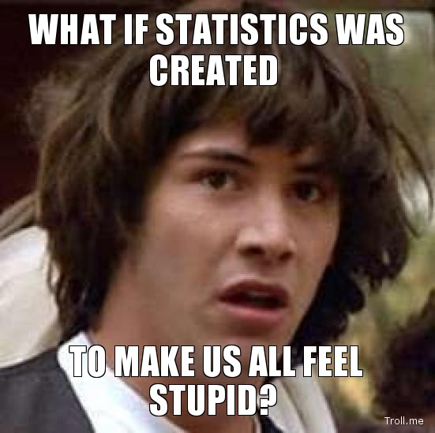

class: middle, center
name: quote-slide

<script>
document.getElementById('myVideo').addEventListener('ended',myHandler,false);
function myHandler(e) {
    console.log('ended');
    setTimeout(function(){
        document.getElementById('myVideo').play();
    }, 5000);
}
</script>


```{r reference-setup, include=FALSE, cache=FALSE}
library(RefManageR)
BibOptions(check.entries = FALSE,
           bib.style = "authoryear",
           # cite.style = "numeric",
           style = "markdown",
           hyperlink = FALSE,
           dashed = FALSE)
refs <- ReadBib("./references.bib", check = FALSE)
```

```{r setup, include=FALSE}
options(htmltools.dir.version = FALSE)
library(DiagrammeR)
library(ggplot2)
library(xaringanthemer)
knitr::opts_chunk$set(
  comments = NA,
  echo = FALSE
)
mycolors <- c(
  red = "#f34213",
  purple = "#3e2f5b",
  orange = "#ff8811",
  green = "#136f63",
  white = "#FFFFFF"
)
style_mono_accent(
  base_color = "#1c5253",
  header_font_google = google_font("Josefin Sans"),
  text_font_google   = google_font("Montserrat", "300", "300i"),
  code_font_google   = google_font("Fira Mono"),
  colors = mycolors,
)
```

.pull-left[


### All meanings, we know, depend on the key of interpretation.

#### George Eliot

]

---
template: quote-slide

.pull-right[


### Statistics is the grammar of science.

#### Karl Pearson

]

---
background-image:url('images/animal-aquarium-aquatic-animal-underwater.jpg')
background-repeat:no-repeat
background-position: 100% 50%
background-size: contain

.pull-left[

# Overview

.large[

- Life Science

- Position of Biostatistics in Life Science

- Role of Biostatistics Teaching

- Challenges and Problems

- Agenda to overcome the challenges and problems

- Opportunities

- My experiences and perspective

]

]

---
background-image:url('images/dna.jpg')
background-repeat:no-repeat
background-position: 100% 50%
background-size: contain

# Life Sciences

.pull-left[

Science connected to _living organisms_

].pull-right[]

--

.pull-left[

Mostly medicine and biology, backed by chemistry, physics, and mathematics

].pull-right[]

--

.pull-left[

Sometimes includes the social sciences and humanities

- Causal relationships between behavior/ consciousness and the biology
- Social values, ethics, and priorities interact with scientific application

].pull-right[]

---
class: top center
background-image:url('images/DNA-Corona.jpg')
background-repeat:no-repeat
background-position: -5% 50%
background-size: contain

.left-column[].right-column[

<!-- # Data, Information and Communication -->


]

---
class: inverse
background-image:url('images/wordcloud-biostatistics.png')
background-repeat:no-repeat
background-position: 50% 50%
background-size: auto

---
background-image:url('images/Techno-Human.jpg')
background-repeat:no-repeat
background-position: -5% 50%
background-size: contain

.left-column[].right-column[

# A role Biostatistics can play

.pull-left[

### Focal Component

- Collaborating with different faculties and external resources

- Identify common problems and necessities of students and researchers

].pull-right[

### Initiator & Creator

- Create custom/ tailored coursework

- Plan and run regular workshops based on common problems of student and researcher

- Create tools and educational materials

]
]

---
class: inverse, right, top
background-image: url(images/overcome.png)
background-size: cover

# Challenges

```{r, out.width="15%", fig.align="right", out.extra='style="filter:invert(1)"'}
knitr::include_graphics("images/question-exclamation.png")
```

---
class: top

.left-30[

## Problems on

.large[

- Interpretation

- Importance of statistics

- Causal relationship

- P-value & other concepts

]

].right-70[





]

---
class: top, inverse
background-image: url(images/opportunity.jpg)
background-position: 50% 50%
background-size: cover

---

# Agenda to overcome the challenges

.pull-left[

### Spread the Awareness

- Big Data / Small Data
- Careful Analysis / Throw big data everywhere
- Pretty & trendy / correct & perfect

### Action Plan

- Customize Course with limited resources
  - Online courses
  - Workshops and Seminars
- Bridge the gap: Scientists and Statistician

].pull-right[

### Coding and Programming

_To Code or Not to Code_

- Expensive software discourages researcher
- Coding: More complex analysis
- Coding: Encourage reproducibility

### Opportunity to grow

- Become an integrated component in the most discipline of life sciences
- Encourage and attract new statistician
- Uplift the quality of research and education of the university

]

---
class: top
background-image: url(images/Man-Thinking.jpg)
background-repeat:no-repeat
background-position: -5% 100%
background-size: contain

.pull-left[].pull-right[

## Personal Experiences

- Knowledge sharing between disciplines

## My perspective

- Stepwise plan
  - Short-run:
  - Long run:

]
]

---
class: inverse, middle, center
count: false

# The Secret of getting ahead is getting started.

## Mark Twain

---

# References

```{r refs, echo=FALSE, results="asis"}
NoCite(refs)
PrintBibliography(refs)
```

---
class: inverse, middle, center
background-color: #088983
count: false

<video width="100%" autoplay muted id="myVideo">
<source src="Thank-You.mp4" type="video/mp4">
</video>

```{r, out.width="100%", fig.align="right", out.extra='style="filter:hue-rotate(90deg)"', eval = FALSE}
knitr::include_graphics("images/Thank-You-Square.png")
```
